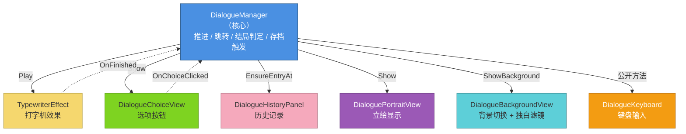

# 《星轨尽头》技术设计文档

> **Version 1.0** · 2026-10-09 · 石诚意

---

## 项目信息

| 项 | 内容 |
|---|---|
| **项目名称** | 星轨尽头（Star Rail's End） |
| **开发引擎** | Unity 2022.3.62f3c1 |
| **开发语言** | C# |
| **项目类型** | 2D 文字冒险 AVG（Visual Novel） |
| **开发周期** | 约 10 天（个人独立开发） |
| **作者** | 石诚意 |
| **仓库** | https://github.com/chengyigg/StarRailEnd |


\---


\## 一、项目概述


\### 1.1 项目简介


《星轨尽头》是一款 2D 文字冒险 AVG，讲述一名转校生与天文社少女一起调查二十年前天文台火灾真相的故事。玩家通过对话选择推动剧情，选择会影响角色好感度，最终走向三种不同结局。


\*\*内容量\*\*：

\- 24 个对话序列（DialogueSequence）

\- 3 个结局（好 / 普通 / 坏）

\- 一周目时长约 30 分钟


\### 1.2 技术目标


本项目重点验证两个技术方向：


1\. \*\*数据驱动的对话系统\*\*：让剧情数据与代码彻底分离，策划只写 CSV 就能生成游戏内容

2\. \*\*组件化的架构设计\*\*：每个模块职责单一，可独立替换、可复用


\### 1.3 技术栈


| 层 | 技术 |

|---|---|

| 引擎 | Unity 2022.3 |

| 语言 | C# |

| UI | UGUI + TextMeshPro |

| 数据 | ScriptableObject + CSV |

| 存档 | JSON (JsonUtility) + PlayerPrefs |

| 版本控制 | Git / GitHub |


\---


## 二、系统架构

### 2.1 整体架构图



### 2.2 架构设计原则

**核心思想**：`DialogueManager` 只负责"剧情走到哪了"，其他所有"怎么显示"的活都交给独立组件。

| 组件 | 职责 | 与 Manager 的交互方式 |
|---|---|---|
| `TypewriterEffect` | 逐字显示文本 | Manager 调用 `Play()`，完成后触发 `OnFinished` 事件 |
| `DialogueChoiceView` | 生成选项按钮 | Manager 调用 `Show()`，点击时触发 `OnChoiceClicked` 事件 |
| `DialogueHistoryPanel` | 历史记录 | Manager 调用 `EnsureEntryAt()` / `Toggle()` |
| `DialoguePortraitView` | 立绘显示 | Manager 调用 `Show(sprite, pos)` |
| `DialogueBackgroundView` | 背景切换 | Manager 调用 `ShowBackground()` / `SetMonologueMode()` |
| `DialogueKeyboard` | 键盘输入 | 独立监听 Input，反向调用 Manager 的公开方法 |

### 2.3 分层结构

```
Assets/
├── Scripts/
│   ├── Core/          引擎基础设施（AudioManager、GameSettings、SceneFader…）
│   ├── Data/          纯数据类（DialogueSequence、SaveData…）
│   ├── Dialogue/      对话系统核心 + 6 个组件
│   ├── Systems/       逻辑系统（SaveManager、AffectionManager…）
│   ├── UI/
│   │   ├── Panels/    大面板
│   │   └── Widgets/   小部件
│   └── Visual/
│       ├── Animators/ 动画组件
│       ├── Stylers/   样式组件
│       └── Effects/   特效与程序化纹理
├── Editor/            8 个 Editor 工具
├── Dialogues/         24 个对话序列 .asset
├── Prefabs/           UI 预制体
├── Resources/         运行时加载资源
└── Scenes/            SampleScene（主菜单） / Game（游戏）
```

\---


\## 三、核心模块设计


\### 3.1 对话系统


\#### 3.1.1 数据结构


```

DialogueSequence (ScriptableObject)     ← 一个对话序列（比如"教室"）

&#x20; ├── sequenceID        序列唯一 ID

&#x20; ├── nextSequenceID    线性跳转目标

&#x20; ├── chapterTitle      章节标题（可选）

&#x20; ├── bgmName           进入时切换的 BGM

&#x20; ├── affectionCharacter / affectionDelta   完成本序列时的好感度变化

&#x20; ├── unlockCharacter   完成本序列时解锁的角色

&#x20; ├── setVariableName / setVariableValue    完成本序列时设置变量

&#x20; ├── conditionalNexts  条件跳转列表

&#x20; └── lines             台词列表

&#x20;       └── DialogueLine

&#x20;             ├── speakerName      说话人

&#x20;             ├── textContent      台词文本

&#x20;             ├── speakerAvatar    头像

&#x20;             ├── background       背景

&#x20;             ├── speakerPortrait  立绘

&#x20;             ├── portraitPos      立绘位置（左/中/右）

&#x20;             └── choices          分支选项列表

&#x20;                   └── DialogueChoice

&#x20;                         ├── choiceText        选项文字

&#x20;                         ├── nextSequenceID    跳转目标

&#x20;                         ├── condition         显示条件（9 种）

&#x20;                         ├── variableName / variableValue

&#x20;                         ├── affectionCharacter / affectionDelta

&#x20;                         └── hideWhenUnmet     条件不满足时隐藏 or 灰掉

```


\#### 3.1.2 设计模式


\*\*观察者模式（事件驱动）\*\*：

\- `TypewriterEffect.OnFinished` → Manager 收到后显示等待指示器

\- `DialogueChoiceView.OnChoiceClicked` → Manager 处理好感度变化 + 跳转


\*\*为什么用事件\*\*：组件之间不直接持有对方引用，Manager 只订阅事件；组件完全不知道 Manager 的存在，可以单独测试或替换。


\*\*策略模式\*\*：

\- 条件判断（`ConditionEvaluator.Evaluate`）封装了 9 种条件：变量相等 / 变量大于等于 / Flag 已设置 / 好感度大于等于 等

\- 选项和条件跳转共用同一套判断逻辑


\*\*为什么这样设计\*\*：如果以后加新条件类型（比如"某物品已持有"），只需要在 `ConditionEvaluator` 加一个 case，所有使用它的地方自动生效。


\#### 3.1.3 关键流程


\*\*玩家点击屏幕时的流程\*\*：

```

点击 → DialogueManager.OnSensorClicked()

&#x20;        ├─ 打字机还在打字？→ 立即显示完整文本

&#x20;        └─ 打字完成？ → NextLine()

&#x20;                         ├─ currentLineIndex++

&#x20;                         └─ ShowCurrentLine()

&#x20;                               ├─ 更新 UI

&#x20;                               ├─ 启动打字机

&#x20;                               └─ 有选项？→ 生成按钮 + 禁用点击感应器

```


\*\*走到序列末尾时\*\*：

```

ShowCurrentLine() 发现 currentLineIndex >= lines.Count

&#x20; ├─ 检查好感度归零 → 触发特殊剧情

&#x20; ├─ 设置序列变量

&#x20; ├─ 检查条件跳转 → 找到第一个满足条件的 targetSequenceID

&#x20; ├─ 没有条件跳转 → 用 nextSequenceID

&#x20; ├─ 有跳转目标 → JumpToSequence()

&#x20; └─ 无跳转目标 → 触发结局

```


\### 3.2 存档系统


\#### 3.2.1 数据结构


```

SaveData（可序列化为 JSON）

&#x20; ├── sceneName          当前场景

&#x20; ├── sequenceID         当前对话序列

&#x20; ├── lineIndex          当前第几行

&#x20; ├── saveTime           存档时间

&#x20; ├── chapterName        章节名

&#x20; ├── playerName         玩家名字

&#x20; ├── screenshotFile     截图文件名

&#x20; ├── affectionKeys / affectionValues   好感度（用 List 不用 Dictionary，因为 JsonUtility 不支持）

&#x20; ├── unlockedCharacters 已解锁角色

&#x20; └── triggeredZeroChars 已触发过归零剧情的角色

```


\#### 3.2.2 存档流程


```

玩家点"保存"

&#x20; │

&#x20; ├─ 1. 收集数据：从 DialogueManager 拿当前进度

&#x20; │     从 AffectionManager 拿所有角色好感度

&#x20; │

&#x20; ├─ 2. 截图：

&#x20; │     - 隐藏存档面板自身（CanvasGroup.alpha = 0）

&#x20; │     - 隐藏底栏

&#x20; │     - 隐藏对话框

&#x20; │     - 等一帧（让渲染完成）

&#x20; │     - ScreenCapture.CaptureScreenshotAsTexture()

&#x20; │     - 缩放成 480×270 保存为 PNG

&#x20; │     - 恢复 UI

&#x20; │

&#x20; ├─ 3. 写入 JSON：SaveManager.SaveToSlot(index, data)

&#x20; │

&#x20; ├─ 4. 刷新 UI

&#x20; │

&#x20; └─ 5. 播放动画（金色光环飞向槽位）

```


\#### 3.2.3 关键技术点


\*\*为什么截图要先隐藏 UI\*\*：

\- 第一版实现时隐藏了整个 Canvas，结果截图是一片蓝色（只剩下摄像机清屏色）

\- 改成"只隐藏遮挡画面的 UI"（存档面板 + 底栏 + 对话框），保留背景和立绘

\- 用 `CanvasGroup.alpha = 0` 而不是 `SetActive(false)`，因为 `SetActive(false)` 会中断协程


\*\*为什么截图会偏白\*\*：

\- `Graphics.Blit` 到 RenderTexture 时，如果是 Linear 色彩空间会产生二次 gamma 转换

\- 第一版尝试用 `RenderTextureReadWrite.sRGB` 修复，仍偏白

\- 最终方案：\*\*不缩放，直接保存原图\*\*（1920×1080 PNG 约 2 MB），放弃 Resize 步骤


\### 3.3 好感度系统


\#### 3.3.1 数据设计


```

存储：PlayerPrefs

&#x20; · 键名："Affection\_" + 角色名

&#x20; · 初始值：从 CharacterData.initialAffection 读取

&#x20; · 范围：0 \~ 100

```


\#### 3.3.2 关键设计


\*\*观察者模式\*\*：

```

AffectionManager.OnAffectionChanged += OnChanged

&#x20; ├─ AffectionPopup 订阅 → 显示 "+10 苏晚" 弹出动画

&#x20; └─ 其他 UI 也可以订阅（好感度面板实时刷新）

```


\*\*多存档独立\*\*：

\- 每个存档有自己的好感度快照

\- 开始新游戏 → `AffectionManager.ResetAll()` 清空 PlayerPrefs

\- 加载存档 → `AffectionManager.LoadFromSaveData(data)` 从 JSON 恢复

\- 存档 → `AffectionManager.FillSaveData(data)` 把当前好感度打包进 JSON


\*\*归零触发特殊剧情\*\*：

```

Set() 发现好感度降到 0 → OnAffectionChanged 触发

&#x20; └─ DialogueManager 检查到好感度归零

&#x20;      ├─ 检查是否已触发过（避免重复）

&#x20;      ├─ 加载该角色的 zeroDialogue

&#x20;      └─ 跳转到这个特殊序列

```


\---


\## 四、关键技术难点


\### 4.1 重构 DialogueManager（900 行 → 400 行）


\#### 问题背景


原始 `DialogueManager` 是一个 900 行的"万能类"，同时管理：

1\. 对话推进逻辑

2\. 打字机效果

3\. 选项按钮生成

4\. 历史记录

5\. 立绘显示

6\. 背景切换

7\. 键盘输入

8\. 存档触发

9\. 结局判定

10\. UI 面板控制


\*\*坏味道\*\*：改任何一个小功能都要翻整个文件，容易碰到别的逻辑。


\#### 重构过程


\*\*原则：小步快跑，每步验证\*\*


1\. \*\*先拆最独立的 `TypewriterEffect`\*\*

&#x20;  - 它只关心"给一段文字，逐字显示"

&#x20;  - 不依赖任何其他系统

&#x20;  - 拆完立刻 Play 测试


2\. \*\*再拆 `DialogueChoiceView`\*\*

&#x20;  - 只负责生成按钮 + 分发点击事件

&#x20;  - 点击后该怎么处理（加好感度、跳转）留在 Manager


3\. \*\*再拆 `DialogueHistoryPanel`\*\*

&#x20;  - 历史记录列表独立成一个类

&#x20;  - Manager 只负责调用 `EnsureEntryAt()`


4\. \*\*再拆 `DialogueKeyboard`\*\*

&#x20;  - Ctrl 快进、Esc 关闭历史

&#x20;  - 独立监听 Input，反向调用 Manager 公开方法


5\. \*\*最后拆 `DialogueBackgroundView` 和 `DialoguePortraitView`\*\*

&#x20;  - 这两个有内部状态（当前背景 / 当前立绘）

&#x20;  - 风险最高，最后拆


\#### 成果


\- `DialogueManager` 从 900 行降到约 400 行

\- 每个组件 50\~150 行，职责清晰

\- 新增功能时知道去哪个文件改

\- 面试时可以讲："我按风险从低到高的顺序分步拆，每步都 commit、都测一遍"


\### 4.2 性能优化（四个坑）


\#### 坑 1：每帧摸 PlayerPrefs


\*\*问题\*\*：`AudioManager.Update()` 每帧调用 `GameSettings.bgmVolume`，而 `GameSettings` 每次都从 `PlayerPrefs.GetFloat()` 读——每帧一次原生调用。


\*\*优化\*\*：

\- `GameSettings` 改成内存缓存 + 脏标记

\- 启动时从 PlayerPrefs 读一次到内存

\- 之后所有读写都在内存完成

\- 脏标记为 true 时，由 `GameSettingsSaver` 定期落盘


\#### 坑 2：拖音量滑块时每秒写几十次磁盘


\*\*问题\*\*：`SettingsManager` 的滑块 `onValueChanged` 里调用 `GameSettings.bgmVolume = v`，而 setter 里每次都 `PlayerPrefs.Save()`——拖动时每秒写几十次磁盘。


\*\*优化\*\*：

\- setter 只改内存 + 标记脏

\- `GameSettingsSaver` 每 0.5 秒检查一次脏标记

\- 退出游戏 / 切后台时强制落盘


\#### 坑 3：每行对话都写一次磁盘


\*\*问题\*\*：`ReadTracker.MarkRead()` 每读到新对话就调用 `Save()`——一次对话几十行 = 几十次磁盘 I/O。


\*\*优化\*\*：

\- `MarkRead` 只改内存 + 标记脏

\- `ReadTrackerSaver` 每 10 秒检查一次

\- 退出时统一落盘


\#### 坑 4：每次打开好感度面板都重建纹理


\*\*问题\*\*：`AffectionSlotUI.BuildSprites()` 每次调用 `HeartSpriteGenerator.Generate()` 都重新生成三张纹理（空 / 半 / 满心），即使颜色完全一样。


\*\*优化\*\*：

\- `HeartSpriteGenerator` 加静态缓存（Dictionary）

\- Key = 状态 + 颜色组合

\- 整个游戏生命周期只生成一次

\- 配合 `AffectionPanel` 的槽位复用（不销毁重建）


\---


\## 五、Editor 工具链（8 个）


为了提升开发效率，我自研了 8 个 Unity Editor 工具：


| 工具 | 解决的问题 |

|---|---|

| \*\*DialogueCSVImporter\*\* | 策划写 CSV 剧本，一键批量生成 ScriptableObject。不用手动在 Unity 里创建 24 个资源、填几百个字段 |

| \*\*DialogueFlowViewer\*\* | 生成剧情流程图，自动检测：死胡同（无跳转且被引用）、断链（跳转目标不存在）、孤立序列（无人引用） |

| \*\*SequenceReferenceFinder\*\* | 追踪任意资源（序列 / Sprite / AudioClip）被哪些序列引用，改资源前知道会影响到谁 |

| \*\*AutoFillSequences\*\* | 一键把 `Assets/Dialogues/` 下所有序列填进 `DialogueManager.allSequences` 列表，省去手动拖拽 |

| \*\*MissingReferenceChecker\*\* | 扫描当前场景所有组件的空引用和 Missing Script，防止打包后崩 |

| \*\*SceneExporter\*\* | 导出场景 Hierarchy 结构为文本，方便对比两个场景差异或备份 |

| \*\*ScriptExporter\*\* | 导出项目全部脚本为单个 txt，方便整体查看或提交 |

| \*\*AssetTreeExporter\*\* | 导出 Assets 目录树状结构（含文件大小），方便整理项目 |


\*\*面试加分点\*\*：大部分应届生不会写 Editor 工具。这说明我不仅会"用"引擎，还会为引擎"开发工具"。


\---


\## 六、测试与验证


\### 6.1 功能测试


每个功能完成后，手动在 Unity 里走一遍完整流程：


| 功能 | 测试用例 |

|---|---|

| 对话系统 | 线性对话 / 分支选项 / 条件选项（灰掉）/ 变量条件 / 好感度条件 |

| 存档系统 | 存档 / 读档 / 覆盖 / 删除单项 / 删除全部 / 跨场景读档 |

| 好感度 | 选项加好感 / 剧情节点加好感 / 归零触发特殊剧情 |

| 结局 | 三种结局分别达成 |

| 快捷键 | Ctrl 快进 / Esc 关闭历史 / 鼠标点击推进 |


\### 6.2 性能验证


\- 用 Profiler 观察 GC Alloc：打字机从每帧分配改成 `StringBuilder` 后，GC 明显减少

\- 存档后检查文件大小：JSON 约 2 KB，截图约 2 MB

\- 反复打开/关闭好感度面板 10 次：第二次之后明显变快（纹理缓存生效）


\### 6.3 边界情况


\- 空存档（槽位没数据）→ 显示"空存档"

\- 存档失败（截图 API 异常）→ 用 try-catch 兜底，只保存数据不保存截图

\- 加载不同场景的存档 → 通过 `PlayerPrefs` 的 `PendingLoadIndex` / `PendingLoadSeqID` 传递参数，场景加载后由 `DialogueManager.Start()` 恢复


\### 6.4 打包验证


\- 打包成 Windows exe（约 127 MB）

\- 在没有 Unity 环境的机器上运行

\- 测试：主菜单 → 开始游戏 → 输入名字 → 对话 → 存档 → 退出 → 重新打开 → 继续游戏


\---


\## 七、总结


\### 7.1 项目收获


1\. \*\*数据驱动设计\*\*：剧情与代码彻底分离，策划可以独立修改内容

2\. \*\*组件化架构\*\*：900 行核心类拆成 7 个组件，职责清晰

3\. \*\*工程化意识\*\*：缓存、懒加载、事件驱动、延迟落盘、日志分级

4\. \*\*工具链开发\*\*：自研 8 个 Editor 工具，显著提升开发效率

5\. \*\*AI 工具链实践\*\*：美术 / 音乐 / 剧本用 AI 生成，代码和系统设计独立完成


\### 7.2 可优化方向


1\. \*\*对话系统\*\*：目前 ScriptableObject 加载所有序列到内存，序列非常多时可以改成按需加载

2\. \*\*存档系统\*\*：JSON 明文存储，正式项目应该加密或压缩

3\. \*\*本地化\*\*：目前硬编码中文，正式项目应抽出文本表支持多语言

4\. \*\*单元测试\*\*：目前主要靠手动测试，可以引入 Unity Test Framework 写自动化测试


\---


\*\*文档结束\*\*

